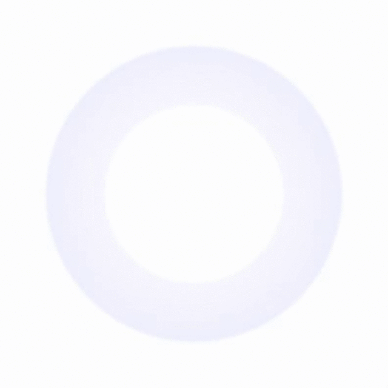

# RHPlaygroundFreestyle 🌶
Sometimes I try to draw something in Playground, and if I decide whether it should be kept for the future usage, I will put this piece of .playground code in this repo 🍰

## Swift support
| Swift 3.0 |

## Pulse 🔵
Simple slice of code which use 'CAReplicatorLayer' and 'CABasicAnimation' classes to create cool looking pulse animation.

Pulse in action 😱:

## Hypnotize 🌀
It is some kind of Pulse 🔵 variation.

Hypnotize in action 😱:

## Play with it 🍭
Feel free to clone repo and play with my code, maybe one of prepared playgrounds will inspire you to create some cool additional effects for your UI. 😉
